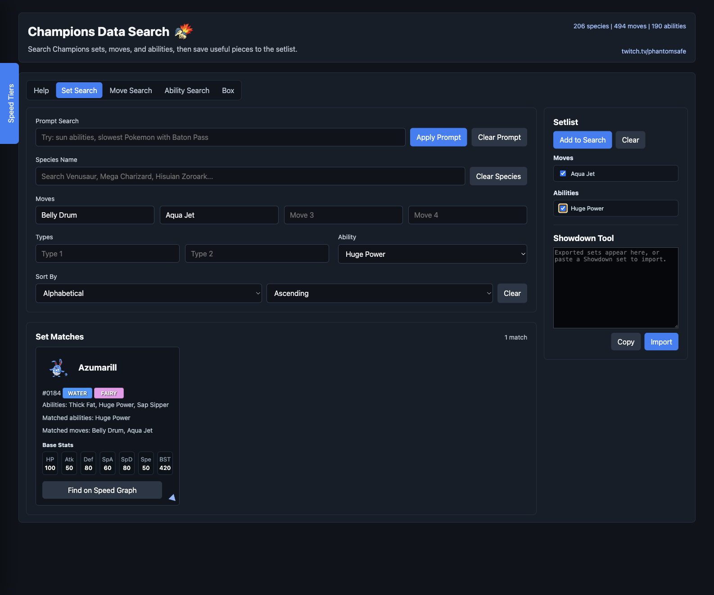
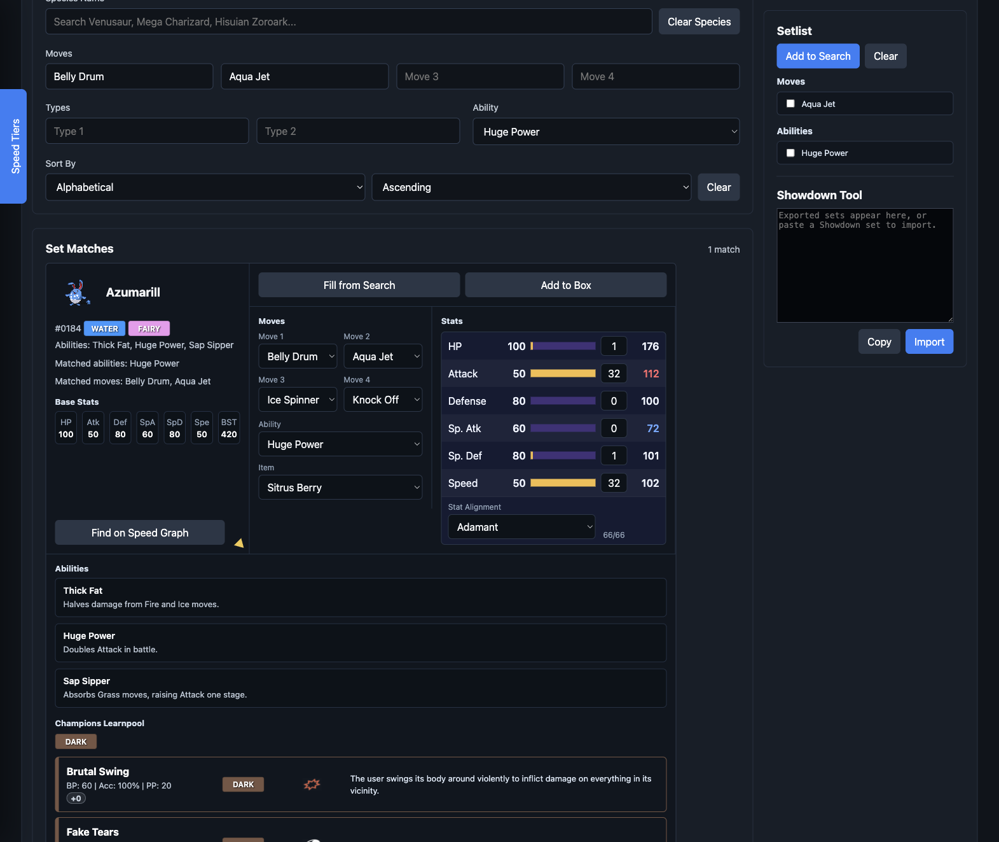
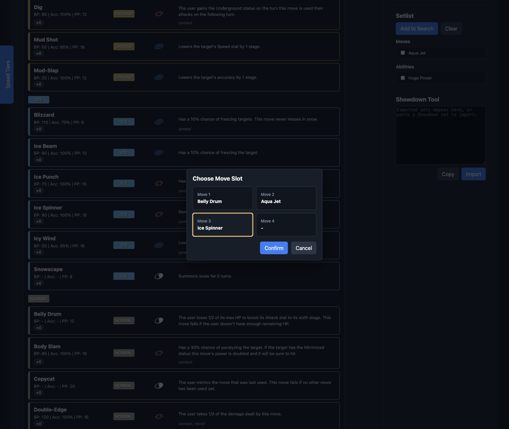
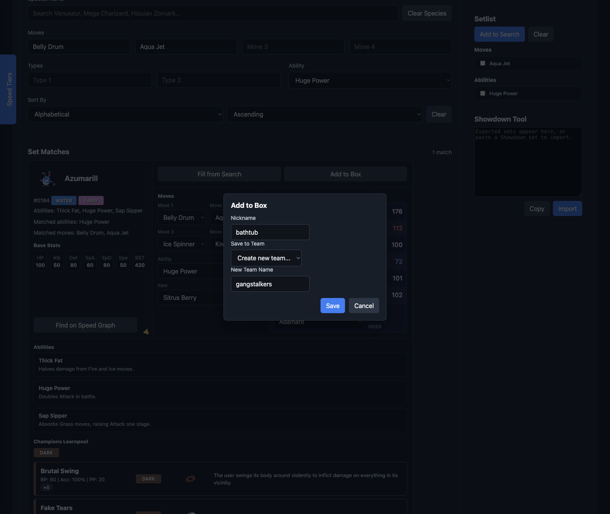
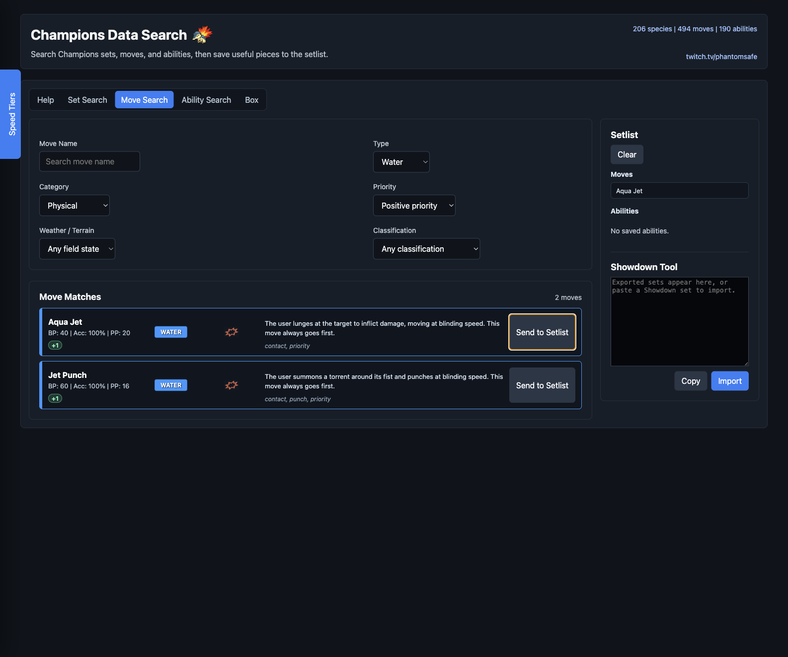
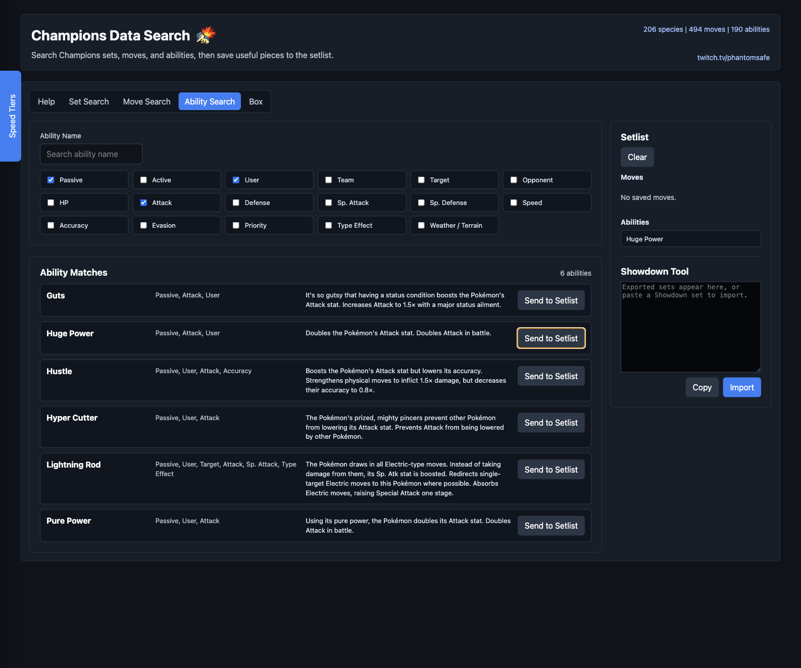
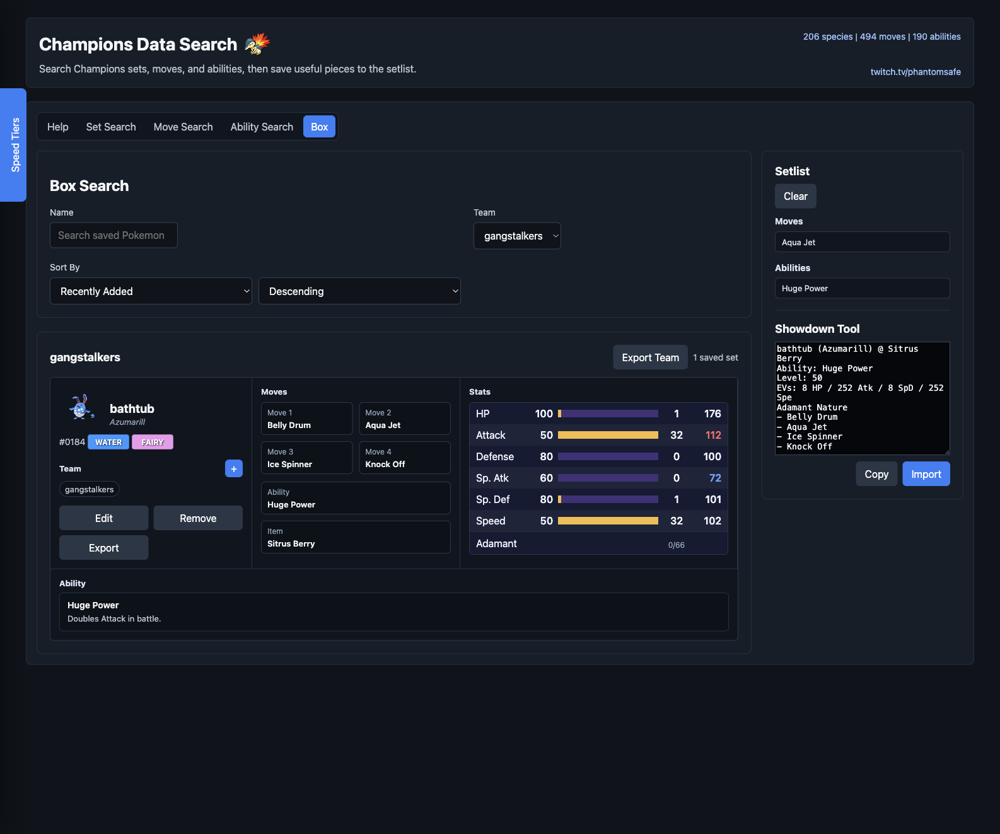

# Champions Data Search

A little tool from a little tool. Pokemon Champions database search and team builder, all the stuff that should've been in the game already.
Showdown export/import, be sure to use the Champions format.

Watch me on Twitch! https://www.twitch.com/phantomsafe
Join my Discord! https://discord.gg/HBr2zJHz2

A static data/search tool for Pokemon Champions sets, moves, abilities, items, saved Box configurations, and Showdown-style import/export.

## Opening The Tool

Open the published GitHub Pages link, or serve the folder locally and open `index.html`.

```bash
python3 -m http.server 8000
```

Local URL:

```text
http://127.0.0.1:8000/Champions%20Move%20Finder/index.html
```

## Set Search

Set Search finds Pokemon that match move, type, ability, species, and prompt filters.

- Prompt Search accepts plain-language searches such as `sun abilities`, `psychic terrain related moves`, or `slowest Pokemon with Baton Pass`.
- Species Name searches base species, Mega forms, regional forms, and supported alternate forms.
- Move fields search for Pokemon that can learn all entered moves.
- Type fields filter by Pokemon type.
- Ability filters by ability.
- Sort controls change the result order and direction.

Each result starts as a compact card. Use the triangle arrow in the lower-right corner to expand it.



## Setlist

The Setlist appears on the right side of the app.

- Move Search and Ability Search add entries with Send to Setlist.
- Moves and abilities are kept under separate headers.
- On Set Search, each saved entry has a checkbox.
- Up to four checked moves and one checked ability can be sent into Set Search.
- Add to Search clears the Set Search move and ability fields, then fills them with the checked Setlist entries.
- Clear removes the saved Setlist entries.
- The Setlist is saved in browser storage until Clear is pressed.

## Expanded Details

Expanded details let you test and save a possible set configuration.

- The compact card stays in the expanded row.
- The Moves section has four move dropdowns, plus ability and item dropdowns.
- Fill from Search copies the currently entered Set Search moves and ability into the expanded configuration.
- Add to Box saves the current configuration.
- The stat table lets you choose a nature and enter EVs from 0-32 per stat, up to 66 total.
- Final stats update from the selected EVs and nature.
- Learnpool moves are grouped by type. Click a move to choose which move slot it should fill.
- Ability descriptions show the possible abilities for that Pokemon or form.







## Move Search

Move Search finds moves directly.

- Search by move name, type, category, priority, target, weather or terrain connection, and classification.
- Results show move name, type, category, BP, PP, accuracy, target, priority, description, and classifications when available.
- Send to Setlist saves that move to the Setlist.



## Ability Search

Ability Search finds abilities directly.

- Search by ability name.
- Toggle filters such as passive, active, user, team, target, opponent, stat effects, priority, type-effect activation, and weather or terrain.
- Results show ability names and descriptions.
- Send to Setlist saves that ability to the Setlist.



## Box

The Box tab stores saved Pokemon configurations.

- Search by name or nickname.
- Filter by team, or view the entire box.
- Sort using the same sort options as Set Search, plus Recently Added.
- Saved configurations remain part of the full box even when assigned to a team.
- Team view shows only that team.
- Teams can hold up to six configurations and cannot include duplicate species lines.
- Edit makes a saved configuration editable, including nickname, moves, ability, item, EVs, nature, learnpool picks, and ability references.
- Erase deletes a configuration from the full box.
- Remove appears in team view and removes the configuration from that team without deleting it from the box.
- The plus button next to the Team header opens the team assignment prompt.
- Export sends one saved configuration, or a whole team/filtered view, to the Showdown Tool.



## Showdown Tool

The Showdown Tool appears below the Setlist.

- Export fills the text box with Showdown-style notation.
- Copy copies the current text.
- Import reads a pasted Showdown set and opens a confirmation preview.
- Confirm adds the imported set to the Box as a saved configuration.

## GitHub Pages

This repository is intended to publish from the root of the `main` branch.
